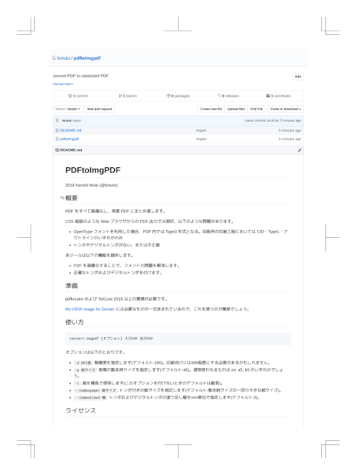

PDFtoImgPDF
===========

2019 Kenshi Muto (@kmuto)

## 概要
PDF をすべて画像化し、再度 PDF にまとめ直します。

CSS 組版のような Web ブラウザからの PDF 出力では現状、以下のような問題があります。

- OpenType フォントを利用した場合、PDF 内では Type3 形式となる (印刷所の印刷工程においては不正)
- トンボやデジタルトンボがない、または不正確

本ツールは以下の機能を提供します。

- PDF を画像化することで、フォントの問題を解消します。
- 正確なトンボおよびデジタルトンボを付けます。



## 準備
pdftocairo および TeXLive 2018 以上の環境が必要です。

[Re:VIEW image for Docker](https://hub.docker.com/r/vvakame/review/) には必要なものが一式含まれているので、これを使うのが最も簡単でしょう。

## 使い方
```
convert-imgpdf [オプション] 入力PDF 出力PDF
```

オプションは以下のとおりです。

- `-d DPI値`: 解像度を指定します(デフォルト:180)。印刷向けには600程度にする必要があるかもしれません。
- `-p 紙サイズ`: 実際の製本時サイズを指定します(デフォルト:a5)。通常使われるものは a4, a5, b5 のいずれかでしょう。
- `-l`: 紙を横長で使用します(このオプションを付けないときのデフォルトは縦長)。
- `--tombopaper 紙サイズ`: トンボ付きの紙サイズを指定します(デフォルト:製本時サイズの一回り大きな紙サイズ)。
- `--tombobleed 幅`: トンボおよびデジタルトンボの塗り足し幅をmm単位で指定します(デフォルト:3)。

## ライセンス
```
Copyright (c) 2019 Kenshi Muto

Permission is hereby granted, free of charge, to any person obtaining a copy
of this software and associated documentation files (the "Software"), to deal
in the Software without restriction, including without limitation the rights
to use, copy, modify, merge, publish, distribute, sublicense, and/or sell
copies of the Software, and to permit persons to whom the Software is
furnished to do so, subject to the following conditions:

The above copyright notice and this permission notice shall be included in
all copies or substantial portions of the Software.

THE SOFTWARE IS PROVIDED "AS IS", WITHOUT WARRANTY OF ANY KIND, EXPRESS OR
IMPLIED, INCLUDING BUT NOT LIMITED TO THE WARRANTIES OF MERCHANTABILITY,
FITNESS FOR A PARTICULAR PURPOSE AND NONINFRINGEMENT. IN NO EVENT SHALL THE
AUTHORS OR COPYRIGHT HOLDERS BE LIABLE FOR ANY CLAIM, DAMAGES OR OTHER
LIABILITY, WHETHER IN AN ACTION OF CONTRACT, TORT OR OTHERWISE, ARISING FROM,
OUT OF OR IN CONNECTION WITH THE SOFTWARE OR THE USE OR OTHER DEALINGS IN
THE SOFTWARE.
```
